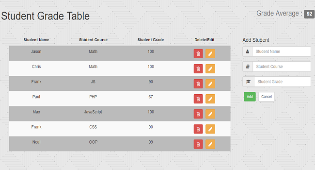

# Student Grade Table

**About the Project**

This project was a great platform for learning C.R.U.D (Create Read Update Delete) operations.  Initially the functionality was implemented via JavaScript and jQuery.  Later on in the course, the Angular JS framework was also used to recreate the project.  After the course I decided to solidify my knowledge with JavaScript and jQuery by recreating it again and using Firebase as the database.

**Features Added**

* Mobile Responsive Design (Bootstrap)
* C.R.U.D
* Firebase database integration

**Features to Implement**

* Input validation
* Delete & edit confirm
* Filter / Sort

